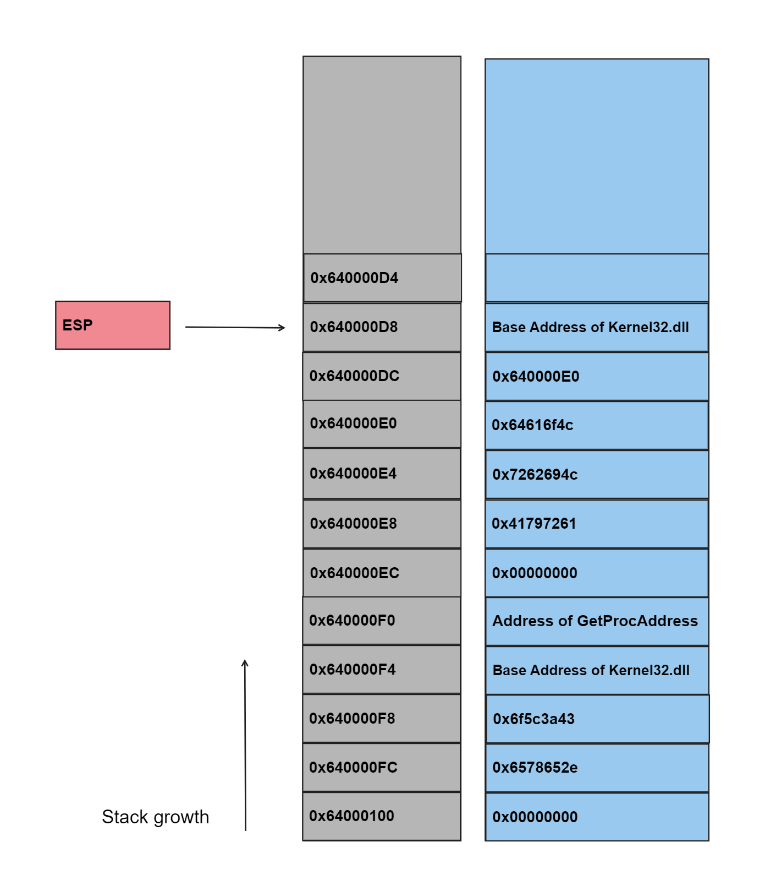
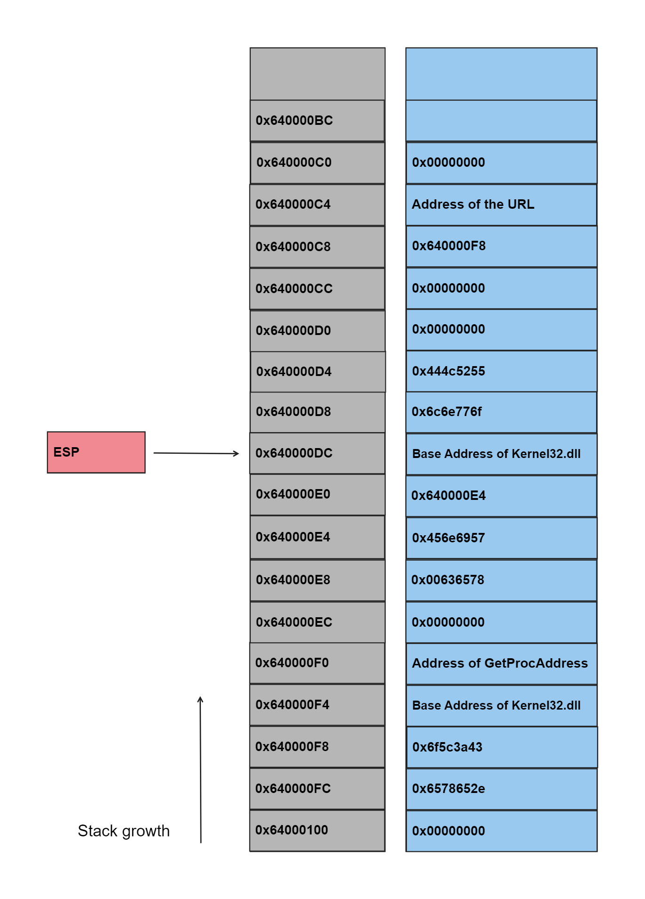

# ShellCode-Analysis

> [!NOTE]
> Note that Stack addresses in the images below are fictuas and placed to trace the changes in the stack during the lifetime of the ShellCode.

***

1\. The first instruction is `xor ecx, ecx` which is used to zero out `ecx` register.

> [!NOTE]
> Using `xor` is better than `mov ecx, 0`, as `mov ecx, 0` opcode is B9 00 00 00 00 which has more space than `xor ecx, ecx` which its opcode is 33 C9 so it saves 3 bytes. and also the benefit of using `xor` is that its opcode doesn't have null bytes which is better while writing the exploit in memory so it doesn't terminate the writing process.

2\. The second instruction is `mov eax, dword ptr fs:[ecx + 0x30]` 
It's known that FS segment register is where Windows stores TEP structure (Thread environment block) on 32-bit Windows. [][FS_Segment_Register] 
Refering to Microsoft documentation for [TEP structure] we found that offset 0x30 is the address of PEB (Process Environment Block).

3\. Then we look in [PEB structure] for offset 0xc which is a pointer to the  _PEB_LDR_DATA  structure that contains information about the loaded modules of the process. see Figure 1 (the upper right corner)

*
Figure 1 (note that all data structures are from microsoft documentation and merged together to make it more clear)
*

4\. Then we look in [_PEB_LDR_DATA] structure for offset 0x14 which is the address of InMemoryOrderModuleList which is the head of a doubly-linked list that contains the loaded modules for the process. see Figure 1 (the upper middle block).  
> [!NOTE]
> Note that the first module in the linkedlist is the executable file itself. 

5\. Then it follows the FLINK which points to the _LIST_ENTRY of the second loaded module. see Figure 1 (the down left corner) 
as we don't know what this module is while analysing the shellcode we have two options. 
the first one is to run the exploit on real environment and attach a debugger and see the loaded modules. *I tried this option but the debugger crashed (I don't know why)* 
the second one is to run the exploit and create a live memory dump of the process by right clicking on the process in task manager then choose create dump file and then use WinDBG to analyze the loaded modules. *this option worked for me*. 
I searched for how to display the loaded modules and found this [URL] and by using this script I found that **ntdll.dll** is the second loaded module and the first one is the process being analysed. see Figure 2

  

*
Figure 2
*

7\. Then it follows the FLINK to the third module which is **kernel32.dll**.

8\. Then it loads `ebx` with the base address of kernel32.dll. see Figure 1 (the lower middle block).

9, 10. before this instruction, `ebx` contains the base address of kernel32.dll which is the begining of DOS header.
Then it moves to the offset 0x3C (e_lfanew) which is the address of PE header. [][PE-File-Format-Offsets] 
Then adds this address to the base address of the dll as it's relative to the base. 

11, 12. now `edx` points to [ExportDirectory] which is in offset 0x78 from PE header.

13, 14. after that `esi` points to `edx + 0x20` which is the AddressOfNames field which is a table of pointers, each one points to a name of an exported API.

19, 20. Then it gets the first address of the AddressOfNames address table.

21\. Then it compares the first four bytes with 0x50746547 which is "GetP". *don't forget the endianness*.

23, 29. The same as before it compare the second and third four bytes with 0x41636f72 and 0x65726464 which is "rocA" and "ddre" respictivly.
So it searchs for string GetProcAddre which it seems searching for [GetProcAddress] API.
 
> [!NOTE]
> This is a for loop used to search for GetProcAddress API, so when we reach GetProcAddress API in Name Pointer Table, the value of `ecx` will point to the index of its corresponding ordinal number in Ordinal Table (the index of API name in the Name Pointer Table is the same as its index of ordinal number in Ordinal Table). 
> Refer to these pages to get more info about exports section in PE file. 
> https://learn.microsoft.com/en-us/archive/msdn-magazine/2002/march/inside-windows-an-in-depth-look-into-the-win32-portable-executable-file-format-part-2 
> https://resources.infosecinstitute.com/topics/reverse-engineering/the-export-directory/

30, 31. from instruction number 12, `edx` contains the address of ExportDirectory.
The offset 0x24 is AddressOfNameOrdinals which is the address of the ordinal table, relative to the image base. 

32, 33. before this instruction, `ecx` has the index of GetProcAddress in Name Pointer Table.
Then it gets the ordinal number of GetProcAddress from Ordinal Table.
Then it decrements `ecx` by one as Export Address Table begins with index 0 

34, 35. in these instructions it gets the address of Export Address Table and as we did before add it to the base address.

36, 37. Then it uses the ordinal number obtained in instructions 32 and 33 to get the address of GetProcAddress in Export Address Table.

38-43. Then it pushes the string ***C:\o.exe*** into the stack followed by null bytes to terminate the string, *pushed in reverse order as the stack grows from high memory address to low memory address, so the beging of the string which is **C:\o** will be in low memory address*. Then it pushes the base address of Kernel32.dll and the address of GetProcAddress into the stack. these values will be used later.

44-48. Then it pushes the string ***LoadLibraryA*** followed by null bytes into the stack and then pushes the `esp` which points to the top of the stack which effectively creates a pointer to the previously pushed string. By doing so, the shellcode sets up the necessary parameters for subsequent function calls. see Figure 3.

  

*
Figure 3
*

49-50. Then calls `edx` (GetProcAddress). 
but before calling [GetProcAddress] it pushed the parameters required by this API which are a pointer to the name of the API we want to get its address, *as we discussed in the previous instructions*, and a handle to the DLL that contains the API, in our case it pushed the base address of Kernel32.dll. see Figure 4. 
after caling GetProcAddress, `eax` will contain the address of LoadLibraryA which we could use to load other libraries.

  

*
Figure 4
*

51\. before calling this instruction, `esp` points to the address `0x640000E0` as Windows APIs use `__stdcall` [calling convention] which means that callee is the responsible for cleaning the parameters so the two top values of the stack `0x640000DC` and `0x640000D8` are cleaned by GetProcAddress.
see figure 5.

  

*
Figure 5
*

After this instruction, `esp` will point to `0x640000EC`.
see figure 6

  

*
Figure 6
*

52-54. Some operations are done.
see figure 7

  

*
Figure 7
*

55-60. Then it pushes ***urlmon.dll*** into the stack. then pushes `esp` which points to the address of ***urlmon.dll*** string. then calls `eax` which contains the address of LoadLibraryA API. see Figure 8 
These instructions call LoadLibraryA to load urlmon.dll.

  

*
Figure 8
*

61\. see Figure 9. *Don't forget that LoadLibraryA will clean the pushed parameter*

  

*
Figure 9
*

62\. Then it gets the address of GetProcAddress from the stack using `esp + 0x4`.
see Figure 9.

63-74. as the same before, it pushes ***URLDownloadToFileA*** string and calls GetProcAddress to get URLDownloadToFileA's address from urlmon.dll.
see Figure 10.

  

*
Figure 10
*

76\. Then it loads the address `esp + 0x24` into `edx` which is the address `0x640000F8` which is the beging of ***C:\o.exe*** string.
see Figure 11.

  

*
Figure 11
*

77-102. Then pushes two 4-byte null bytes and the address of string ***C:/o.exe***. Then jumps to LAB_00000133 which in turn calls the instruction in line 101. 
The reason for doing this is to push the address of the URL into the stack as call instruction pushes the next address into the stack. While returning to the caller function, it will pop this value out to the `EIP` using `RETN` instruction. 
After that it calls [URLDownloadToFileA]. 
To conclude what happened, these instructions call URLDownloadToFileA to download a file from URL ***https[:]//raw.githubusercontent.com/accidentalrebel/accidentalrebel.com/gh-pages/theme/images/test.png*** and saves it to ***C:\o.exe*** 
see Figure 12.

  

*
Figure 12
*

103\. After this instruction the stack will be as Figure 13.

  

*
Figure 13
*

105-108. Then it loads `edx` and `ebx` with the address of GetProcAddress and the base address of Kernel32.dll respictivily, by poping then pushing these values in the same order.

109-113. Then pushes ***xeca*** into the stack but replaces the last character '***a***' with null byte so the result will be "***xec\0***". then it pushes ***WinE*** so the final result will be ***WinExec***.

114-115. Then it pushes `ebx` which is the base address of Kernel32.dll. 
finally it calls GetProcAddress.
see Figure 14.

  

*
Figure 14
*

116-119. it then pushes 5. see Figure 15.  
Then pushes the address of `esp + 0x18` which is ***C:\o.exe***. see Figure 16. 
Then [WinExec] is called to execute the downloaded file ***C:\o.exe***. 
The [optional parameter] which is 5 is used to activate the window and displays it in its current size and position.

  

*
Figure 15
*

  

*
Figure 16
*

120\. After this instruction the stack will be as Figure 17.

  

*
Figure 17
*

121-122. Then it pops the address of GetProcAddress and the base address of Kernel32.dll out of the stack into `edx` and `ebx` respictivily.
see Figure 18.

  

*
Figure 18
*

123-126. Then it pushes ***essa*** then subtracts 0x61 from the `esp + 0x3` which causes the last character to be null "***ess\0***". then it pushes the remaining string. 
The final string will be ***ExitProcess***

127-129. Then it pushes `esp` and the base address of Kernel32.dll then call GetProcAddress. see Figure 19.

  

*
Figure 19
*

130\. Finally it calls ExitProcess.

## Summery

1. Searches in loaded modules for Kernel32.dll
2. Searches in Kernel32.dll for GetProcAddress
3. Uses GetProcAddress to get the address of LoadLibraryA
4. Uses LoadLibraryA to load urlmon.dll
5. Uses GetProcAddress to get the address of URLDownloadToFileA from urlmon.dll
6. Downloads a file from ***https[:]//raw.githubusercontent.com/accidentalrebel/accidentalrebel.com/gh-pages/theme/images/test.png*** using URLDownloadToFileA and saves it to ***C:\o.exe***
7. Uses GetProcAddress to get the address of WinExec from Kernel32.dll
8. Runs ***C:\o.exe*** using WinExec
9. Gets the address of ExitProcess
10. Calls ExitProcess

[FS_Segment_Register]: https://en.wikipedia.org/wiki/Win32_Thread_Information_Block
[TEP structure]: https://learn.microsoft.com/en-us/windows/win32/api/winternl/ns-winternl-teb
[PEB structure]: https://learn.microsoft.com/en-us/windows/win32/api/winternl/ns-winternl-peb
[_PEB_LDR_DATA]: https://learn.microsoft.com/en-us/windows/win32/api/winternl/ns-winternl-peb_ldr_data
[URL]: https://learn.microsoft.com/en-us/windows-hardware/drivers/debugger/debugger-command-program-examples#walking-the-ldr_data_table_entry-list
[PE-File-Format-Offsets]: http://www.sunshine2k.de/reversing/tuts/tut_pe.htm
[ExportDirectory]: https://learn.microsoft.com/en-us/windows/win32/debug/pe-format#export-directory-table
[GetProcAddress]: https://learn.microsoft.com/en-us/windows/win32/api/libloaderapi/nf-libloaderapi-getprocaddress
[calling convention]: https://learn.microsoft.com/en-us/cpp/cpp/stdcall?view=msvc-170
[URLDownloadToFileA]: https://learn.microsoft.com/en-us/previous-versions/windows/internet-explorer/ie-developer/platform-apis/ms775123(v=vs.85)
[WinExec]: https://learn.microsoft.com/en-us/windows/win32/api/winbase/nf-winbase-winexec
[optional parameter]: https://learn.microsoft.com/en-us/windows/win32/api/winuser/nf-winuser-showwindow
